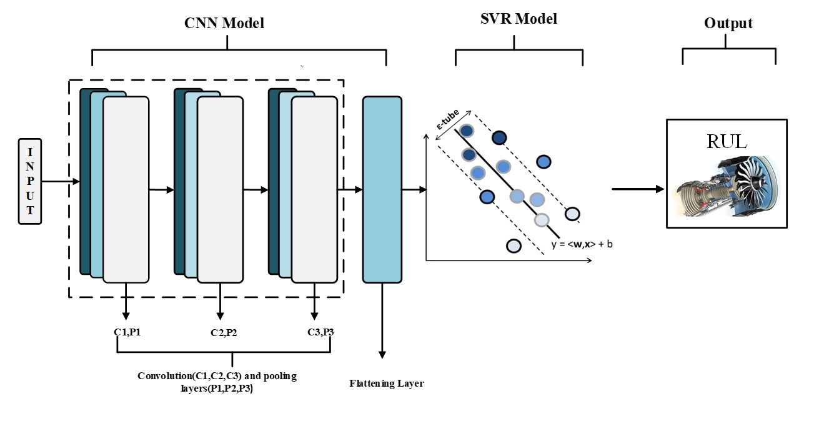
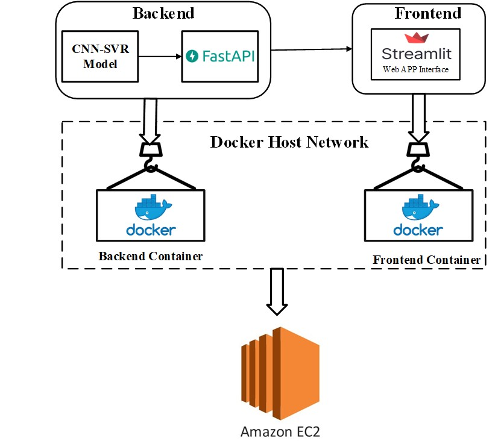

# Prediction of Remaining Useful Life (RUL) for Turbofan Engines
This repository contains  code for predicting the remaining useful life of a turbodan engine based on sensor data using a Convolutional Neural Network (CNN) and Support Vector Regression (SVR) model. It also includes a web app built using Streamlit for the front-end and FastAPI for the back-end. Docker is used to deploy the app on an EC2 instance.

# Dataset
The dataset used in this project is a publicly available dataset of sensor data from a turbodan engine. It includes various sensor readings such as temperature, pressure, and vibration. The goal is to predict the remaining useful life of the engine based on this data

# CNN-SVR Model
The CNN and SVR models were trained using the sensor data from the dataset. The CNN model was used to extract features from the sensor data and the SVR model was used to predict the remaining useful life of the engine based on these features. The models were built using Python and the Keras and scikit-learn libraries.
                                                                 

# Web App
The web app was built using Streamlit for the front-end and FastAPI for the back-end. The app allows users to upload sensor data and get a prediction of the remaining useful life of the engine. The app also includes visualizations of the sensor data and the model's predictions.

# Deployment
The app is deployed using Docker Compose on either a local machine or an EC2 instance. Docker Compose is used to start multiple Docker containers that make up the app.
                                                   

## Local Deployment
To deploy the app using Docker Compose on a local machine, follow these steps:
1. Clone the repo: git clone https://github.com/yourusername/turbodan-engine-prediction.git
2. Install Docker and Docker Compose on your machine if they're not already installed: https://docs.docker.com/get-docker/ and https://docs.docker.com/compose/install/
3. Start the app using Docker Compose by running the following command in the same directory as your docker-compose.yml file: docker-compose up --build This will build the Docker images for the app and its dependencies, create and start the Docker containers, and expose the app on port 8501.
4. Open a web browser and go to http://localhost:8501 to use the app.
5. To stop the app and remove the Docker containers, run the following command: docker-compose down This will stop and remove the Docker containers created by the docker-compose up command.
## EC2 Deployment
To deploy the app using Docker Compose on an EC2 instance, follow these steps:
1. SSH into the EC2 instance.
2. Clone the repo: git clone https://github.com/yourusername/turbodan-engine-prediction.git
3. Install Docker and Docker Compose on the EC2 instance if they're not already installed: https://docs.docker.com/get-docker/ and https://docs.docker.com/compose/install/
4. Start the app using Docker Compose by running the following command in the same directory as your docker-compose.yml file: docker-compose up --build -d  This will build the Docker images for the app and its dependencies, create and start the Docker containers in detached mode, and expose the app on port 80.
5. To allow traffic to the app, configure the security group for the EC2 instance to allow inbound traffic on port 80.
6. Open a web browser and go to http://<ec2_instance_ip> to use the app.
7. To stop the app and remove the Docker containers, run the following command:docker-compose down  This will stop and remove the Docker containers created by the docker-compose up command.

# Demo

https://www.youtube.com/watch?v=05X7luF_MQc

